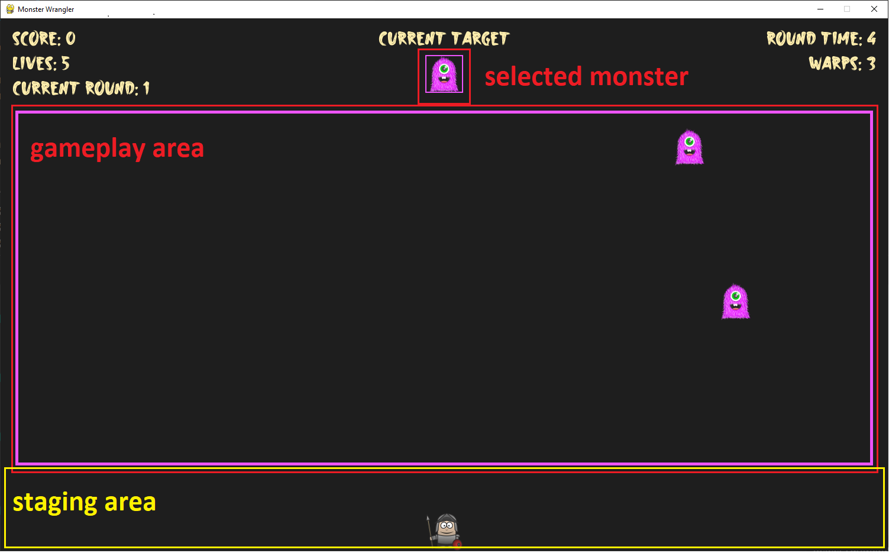

# Welcome

In this game, you will control a Knight that fights monsters. The Knight has to kill a designated monster by colliding with it.
If the Knight collides with monsters that are not the designated one, the Knight loses one live.
Each time a monster is killed, a new monster is randomly designated.

## Gameplay:

1. The Knight starts at the staging area. Once the Knight moved into the gameplay area, Knight can not go back. The only way for the Knight to
be back inside the staging area is to warp. Each time the Knight warps, Knight will lose 1 warp count. Warps count is reset when the Knight collides with a wrong monster. Press **"Space"** to warp the Knight.

2. Control the Knight to collide with the correct monster. The chosen monster is assigned at the top of the HUD. if the Knight collided with the
wrong monsters, the Knight loses a life, and back to the staging area.

3. After clearing all monsters, the Knight goes to next round. As the Knight proceed further in the game, more monsters will be generated in each round.

4. The monsters only bounce inside the gameplay area.

5. Once the Knight collides with the designated monster, all other monsters will adjust their direction towards the Knight.

6. Press **"Enter"** to pause the game. Press **"Enter"** again to continue playing.

## Game Settings:
Configure the game settings in the `settings.py` file.

Happy gaming! 🎮
